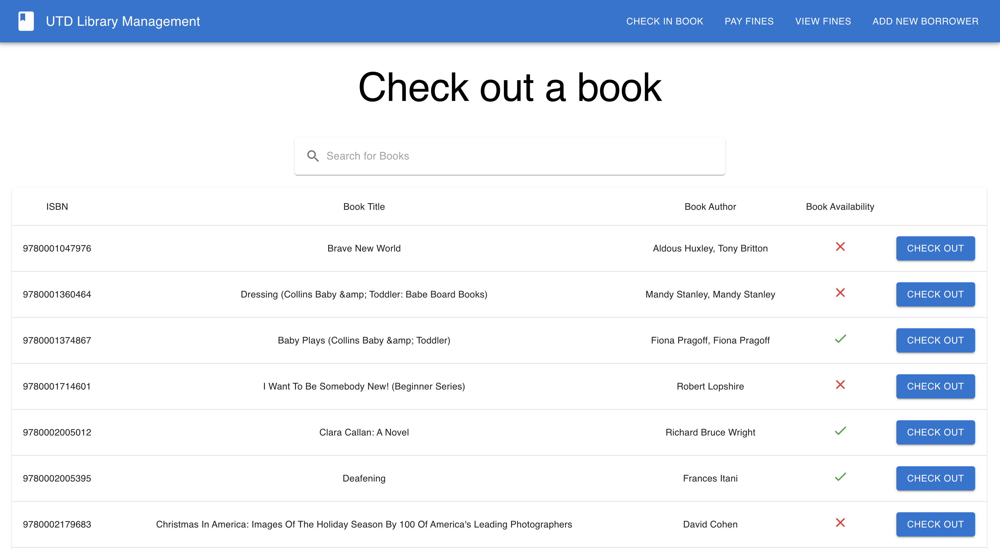
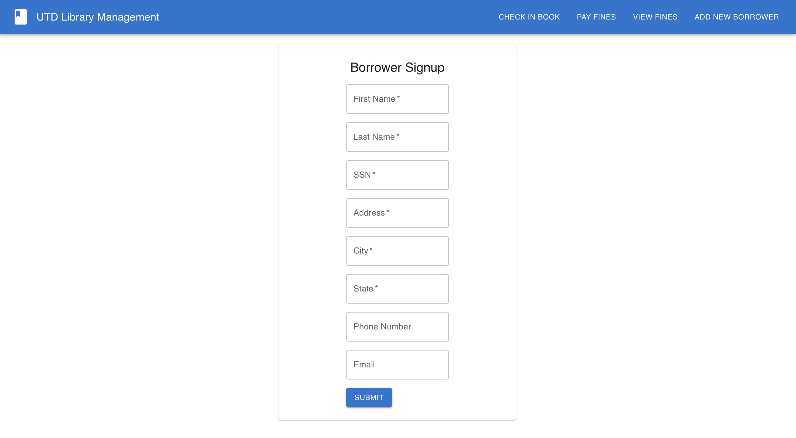

# DBD-Individual-Project
A Full Stack Application for Library Management. This library software supports searching for books, checking out and checking in a book, adding a new borrower into the system and managing and paying fines for late borrowers.

## Compilation Instructions

To execute the full-stack application the following steps are to be followed:

### **Backend Code Compilation**

To execute the backend API code, please run the sqlBackendAPI.py using the following command on the terminal:

            python sqlBackendAPI.py

### **Frontend Code Compilation**

To start the frontend interface, the following steps must be performed.

1. We need to install the node modules to start our frontend interface. cd into the frontend directory and run the following on the terminal.
    
        npm install

2. After installing the node modules, to start the frontend interface, run the following line on the terminal.

        npm start

# Screenshots

## Check out/Homepage

## Check in page

## View Fines page

## Pay Fines page

## Borrower Signup page

